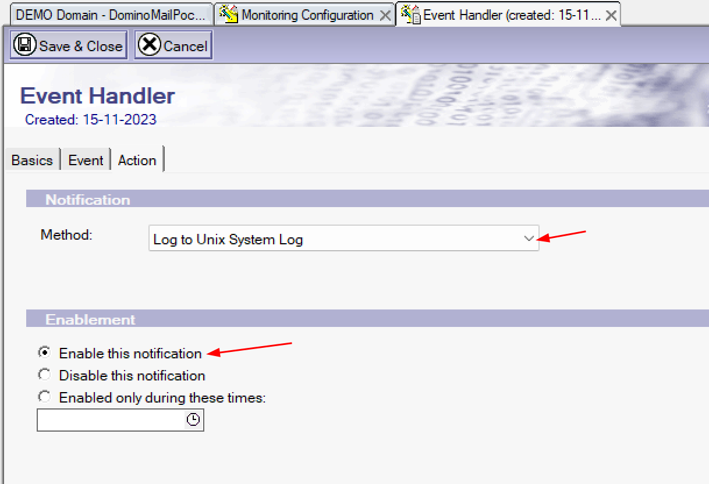

# **Event Logging Domino running on Windows to Linux Syslog**

## **Problem Definition**

Recently a client of mine came to me with a request. He had opened a case with HCL Software regarding writing the Domino Log to Syslog. He wanted to do that but was not sure how to proceed. Also, the reason he wanted this capability was to utimately use **SIEM** software to find patterns or track events.

<!-- more -->

## **Introduction**

**HCL Domino** is a fairly mature collaboration and email solution which does provide a wide range of features. **HCL Domino** already has a feature in which HCL Domino can publish events to either **syslog** or in case of Windows to the **Event Viewer**

## **How to configure logging in Domino to syslog - Linux Server**

> :bulb: For Linux it is fairly simple.

1. You would obviously need your **HCL Domino Server** running on **Linux**.
2. You will need access to `events4.nsf` or Monitoring Configuration Database
   {: style="height:400px;width:640px"}
3. Open the `events4.nsf` and Create a new event handler
   {: style="height:300px;width:600px"}
4. Now you can configure the event handler accordingly. You can look into [Event Handler Documentation from HCL Software](https://help.hcltechsw.com/domino/14.0.0/admin/admn_eventhandlers_t.html "Event Handler Documentation")

   > Some Screenshots below.

   {: style="height:350px"}
   {: style="height:350px;width:600px"}
   {: style="height:350px;width:600px"}

5. Once Done. Please **`Save and Close`**.

6. To view the **syslog** in Linux there are a multiple ways. I used the **`lnav`** or [The Logfile Navigator](https://lnav.org/ "Logfile Navigator").

   

## **How to configure logging in Domino to Windows Event Viewer - Linux Server**

For HCL Domino running on Windows the same steps enlisted above will work.

With the exception of Step 4 where instead of `Log to Unix System Log` select **`Log to Event Viewer`**
{: style="height:350px;width:600px"}

You can now see that the **NotesEvent** start appearing in the **Windows Event Viewer**.
{: style="height:600px;width:900px"}

## **How do you redirect the Windows Event Viewer - Domino Events to Linux Syslog**

The issue is how do you redirect these **NotesEvent** appearing under **Applications** to the **`Linux Syslog`**.

For this you can use a variety of tools essentially you need a log forwarder like [NXLog](https://nxlog.co/) or [GrayLog](https://graylog.org/) or in my **case** I used the [**SolarWinds Event Log Forwarder for Windows**](https://www.solarwinds.com/free-tools/event-log-forwarder-for-windows "SolarWinds Event Log Forwarder for Windows")

> :memo: You have to configure the SolarWinds Event Log Forwarder as shown below

- You will need to configure the Subscriptions as shown.

  {: style="height:400px;width:800px"}

- As you can see we have filtered a few events.

  {: style="height:450px;width:800px"}

- Make sure you log the forwarding events to the **`Kernel`**

{: style="height:450px;width:800px"}

- You will have to select the Linux Server which is running Syslog and define the **_Port_** and the **_IP Address_**.

**Final Step** now we can check our **`lnav`** output on the Linux Server. You can clearly see the details of the events from HCL Domino Server running on Windows.

> :boom: This was my first attempt. Hope you liked it. Please provide your feedback at <rsharma@cloudcollabdevtech.com>. More updates coming...
