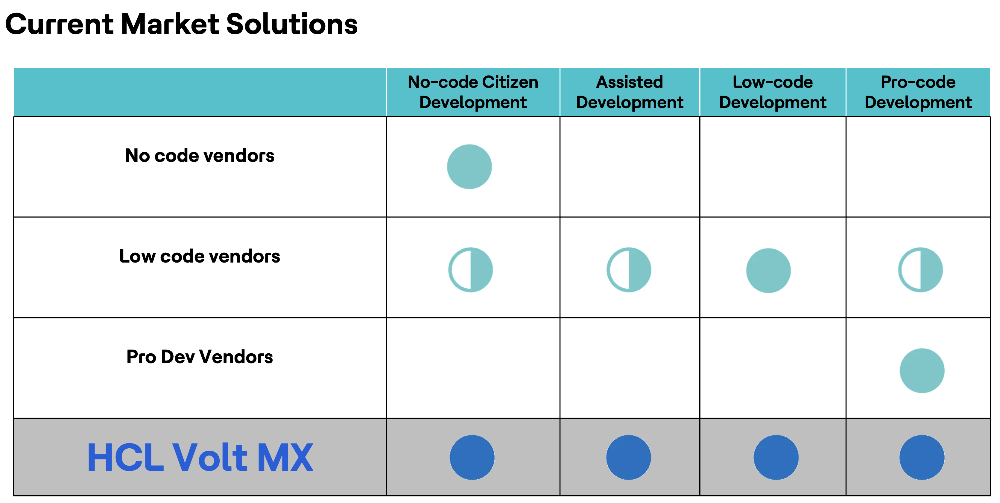
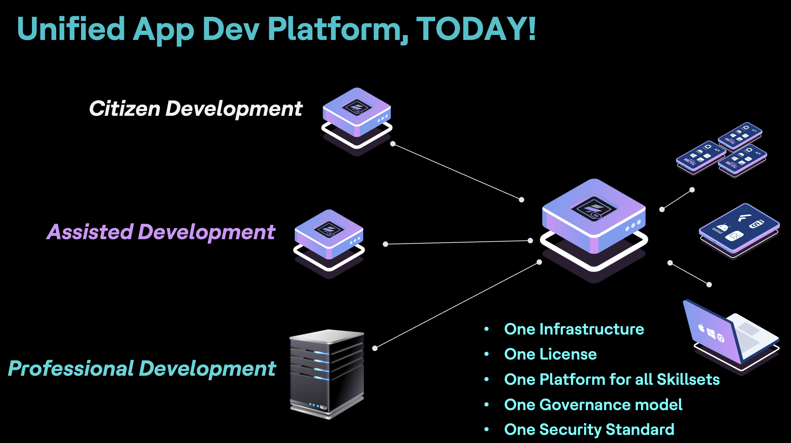

# **Low-Code No-Code or UDP Powered by Volt MX - Primer Series 1 / N**

Week 4 - Blog 4. Keeping in line my committment to deliver one blog article here is the fourth one in the series enjoy the same..

## **Introduction - Digital Transformation**

In today's world, digital transformation is extremely important and relevant. It is a critical factor for businesses to remain competitive and succeed in the digital era. Digital Transformation is essentially a process which requires organisations to embed technology across their businesses to achieve a fundamental change. It is all about achieving greater efficiency and business agility.

Digital transformation enables businesses to leverage innovative technologies and data analytics to enhance decision-making, improve customer experiences, and drive fundamental change.

<!-- more -->

## **Role of Low-Code and No-Code in Digital Transformation**

Low-Code and No-Code Platforms can help in accelerating Digital Transformation.

1. **Low-Code Platforms**: Low-Code platforms allow businesses to develop applications rapidly with minimal coding.
2. **No-Code Platforms:** No-Code platforms take it a step further by eliminating the need for coding altogether. They provide intuitive visual interfaces and pre-built components, enabling non-technical users to build applications and automate workflows.

So in context of Low-Code No-Code we have essentially 3 main types of development approaches.

1. **Citizen Development:**
   - Citizen Development refers to the creation of applications and automation processes by individuals who are not professional developers or coders.
   - Citizen developers primarily utilise Low-Code and No-Code platforms to build applications through visual interfaces, pre-built components, and drag-and-drop functionality.
2. **Assisted Development:**
   - Assisted Development involves collaboration between business users with domain expertise and IT professionals or more experienced developers. Business users leverage Low-Code/No-Code platforms, while IT professionals provide guidance, support, and additional development when necessary.
   - Business users take the lead in creating applications using Low-Code/No-Code tools, while IT professionals offer assistance in ensuring that the solutions align with security, compliance, and integration requirements.
3. **Pro Code Development:**
   - Pro Code Development involves professional developers or experienced coders utilising Low-Code platforms to expedite the development process or streamline repetitive tasks.
   - Professional developers use Low-Code platforms to accelerate certain aspects of the development process, such as integrating APIs, automating routine tasks, or rapidly prototyping solutions.

## **What is Unified Development Platform - UDP**

With the multitude of tools, platforms, organisations in this space of Low-Code No-Code solutions unfortunately there is no single tool which does that effectively. We have some vendors / solutions which excel in one area but are found lacking in others as you can see below.

{: style="height:400px;width:720px"}

This is where Unified Development Platform - UDP can fill that void. The basic goal of UDP is to bring together different development approaches and meet the varying requirements of citizen developers, business users and professional developers. So in essence UDP should be able to guarantee:

- **Support for Diverse User Groups**
- **Unified Single Environment**
- **Low-Code and No-Code Capabilities**
- **Scalability and Extensibility**
- **Collaboration and Governance**
- **Multi Device Functionality**
- **Analytics and Monitoring**
- **Integration and Connectivity**
- **Single Code Base - One Size Fits all**
- **Single Infrastructure**
- **Single License**

## **Unified Development Platform (UDP) - Powered by HCL Volt MX**

HCL Volt MX is an industry-leading Unified Development Platform providing No-Code, Low-Code and Pro-Code capabilities. You can deliver beautiful apps — fast — across any device, all on one platform.

{: style="height:400px;width:720px"}

HCL Volt MX can accelerate you journey in the following ways:

- **One Platform for All Your Needs** - Simplify and consolidate all other app dev platform investments. HCL Volt MX provides one unified platform for all skillsets to build apps under one infrastructure, license, governance model and security standard.
- **Unlock the Potential of Every Employee** - Harness innovation from everyone in the business and enable them to solve their own digital challenges while promoting strong collaboration between business users and IT.
- **Multiexperience Innovation** - From progressive web apps (PWAs) to native mobile apps, reach your users wherever they live digitally across any device, even wearables and kiosks – all on a single code base.
- **Accelerated App Delivery** - HCL Volt MX combines the speed and ease of low-code development with enterprise backend services and integration capabilities, resulting in faster app development and 80% reduction in code.
- **Modernize Legacy Applications** - Evolve, extend, and even replace existing apps with reduced time, complexity, and cost by avoiding full rewrites and disjointed off-the-shelf solutions.

This article is first of many on this topic. Look out for another one next week. Till happy reading and reach out to me if you would want more information..

Happy Reading..
