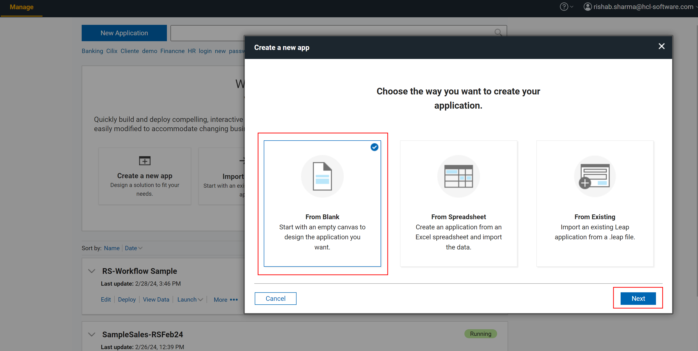
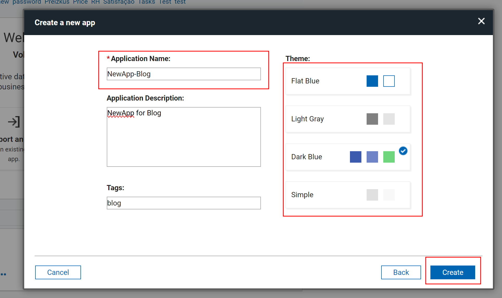
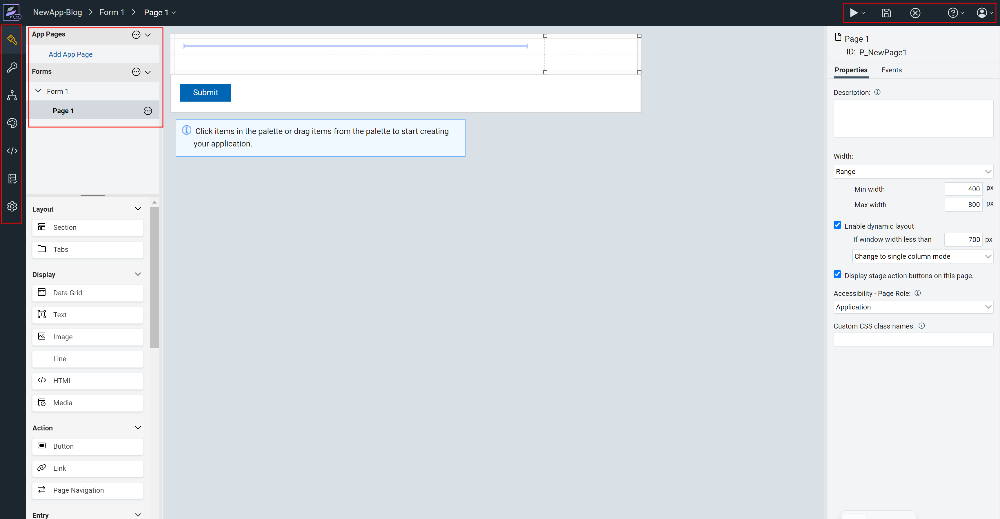
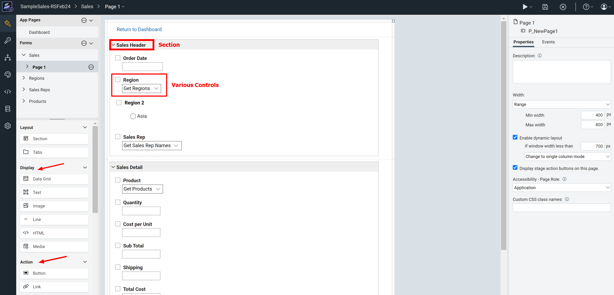
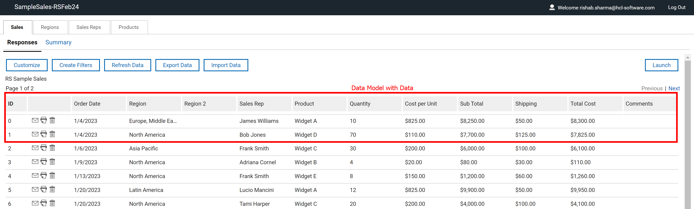
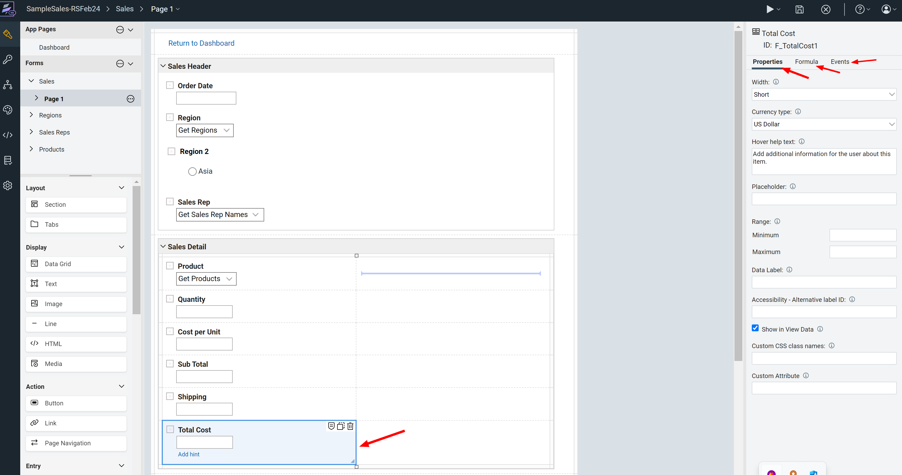
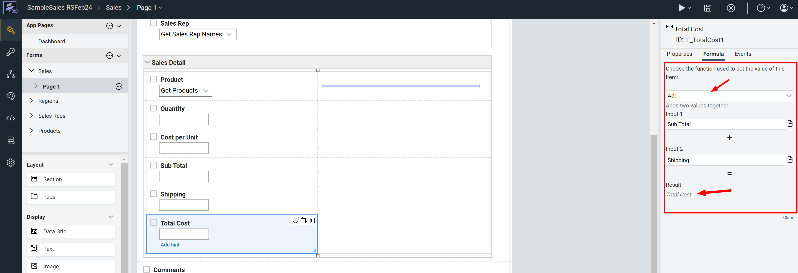
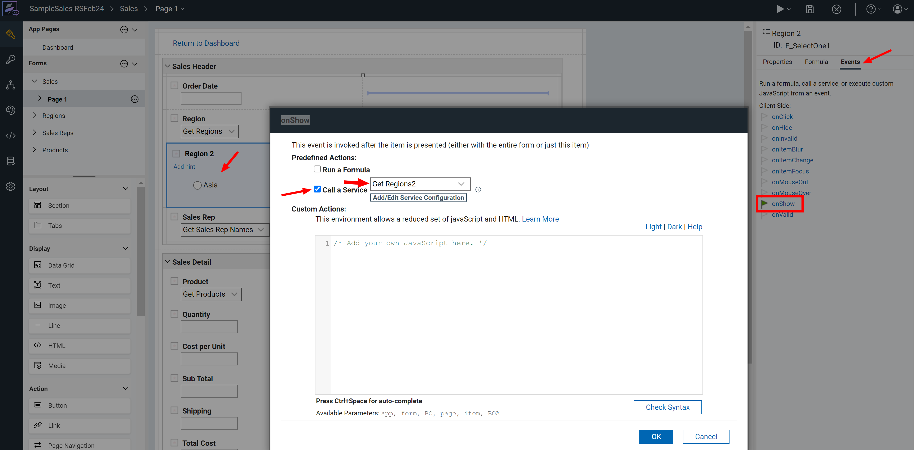
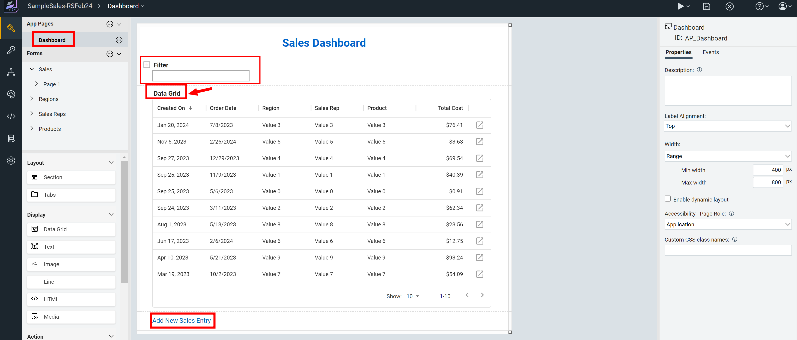
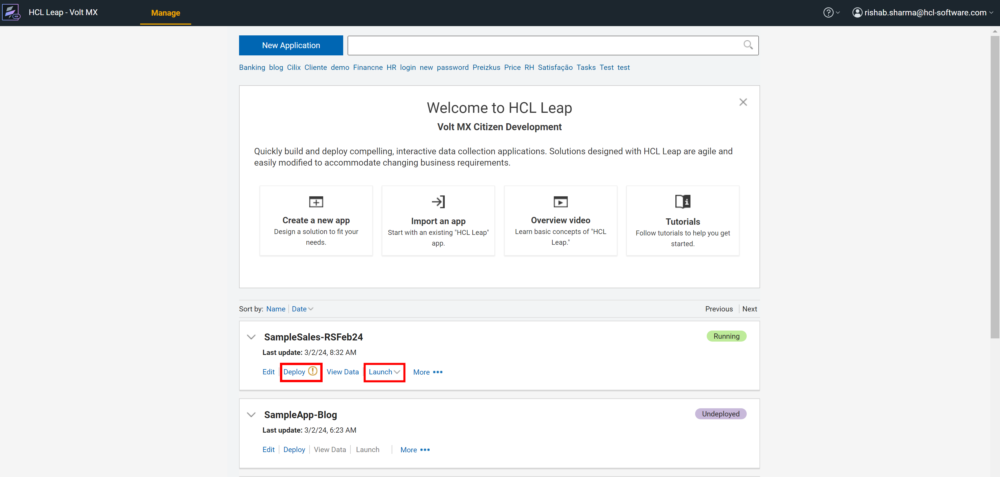

# **UDP (Low-Code No-Code) - Powered by HCL Volt MX - Primer Series 5/N**

## **Introduction to HCL Leap - No Code**

As explained in the [previous article](https://blog.cloudcollabdevtech.com/blog/2024/02/15/udp-low-code-no-code---powered-by-hcl-volt-mx---primer-series-4--n.html) - we got started on HCL Leap and we discovered how we can access Leap and start creating applications on the same.

In this article we will understand how to use **HCL Leap** in further detail especially the form part. **HCL Leap** is very advanced platform which will allow you develop very sophisticated No-Code applications.

Let's delve a little more deeper on **HCL Leap** which is part of the Unified Development Platform powered by **HCL Volt MX**.

<!-- more -->

## **Forms - Basic Building Blocks**

Lets create a blank application to access the Leap Designer.

### **Phase 1 - Blank Application**

Create a Blank Application as show below.

### **Phase 2 - Name and Theme**

You are provided options to name you application and choose a theme.

### **Phase 3 - Launch Designer**

Clicking Create will take you directly to the designer. There are options to access workflow, stages, styles. This is not a tutorial but there are plenty of options. You will also have a palette of controls and also **Save** and other options.

### **Phase 4 - Form Controls**

We can now design a form using various controls. You can use **Section** to organize you items better. **HCL Leap** will automatically create the backend database needed to store values from this form. A sample form is presented below.

You can observe the various sections and layout controls.

### **Phase 5 - Data Model**

You can see the data model for this form is already populated and data is stored in the same. No need to design the database and the object model **HCL Leap** can do that for you.

### **Phase 6 - Field Properties**

You can see that any field you add will have properties to adjust the appearance and other aspects. You will Formula and also Events.

### **Phase 7 - Formula**

You can see formula associated which can automatically compute values like adding _"Sub Total"_ and _"Shipping"_ to get **"Total Cost"**

### **Phase 8 - Events**

You can also configure events which will allow you call a service like **'_onShow_'** event you can a service which populates all the Regions from another Form.

### **Phase 9 - Dashboard or Landing Page**

You can build a Dashboard or a Landing Page for your Application. This page can have links and also a datagrid to show data values which can function like a View. You can create Action or Links to allow users to create new entries.

### **Phase 10 - Deploy / Launch Application**

The final application will be now ready to be deployed and you can manage other aspects of the same.

## **Closing and Followup**

Self Learning Courses for HCL Leap - [**HCL Software University Link**](https://hclsoftwareu.hcltechsw.com/hcl-leap)

[**HCL Leap Sandbox - Trial Account**](https://leapsandbox.hclpnp.com/leap-mx/)

This is the fifth article on this topic. Next Article we shall explore how to build services for lookup and other aspects of building a citizen developer application using **HCL Leap**. Look out for another one next week. Till then happy reading and reach out to me if you would want more information..
