# **UDP (Low-Code No-Code) - Powered by HCL Volt MX - Primer Series 6/N**

## **Introduction to HCL Leap - No Code - Services adding power to lookups**

As explained in the [**previous article**](https://blog.cloudcollabdevtech.com/blog/2024/03/01/udp-low-code-no-code---powered-by-hcl-volt-mx---primer-series-5n.html) - we focussed on the Form Design and various fields or elements that make up a form. It is a critical aspect in designing a No-Code applications. You would ideally start with a form as that is the building block of the application.

In this article we will understand how to use services and other events in **HCL Leap** which will help in automating lookup or populating data from master tables. **HCL Leap** is indeed a very advanced platform which will allow you develop complex No-Code applications.

Let's delve a little more deeper in **HCL Leap** services and events which is part of the Unified Development Platform powered by **HCL Volt MX**.

<!-- more -->

## **Forms - Selection**

We had created a sample form in the last post. There are various options available on the left hand side palette like Layout, Display, Actions, Entry, Calendar, Selection.

### **Phase 1 - Drop Down Selection**

Drop Down presents a choice list to the user when the drop down is selected. The user must choose one of the choices provided. Also referred to as a pop-up.

Drop Down allows for entry of choice list values, or can hook up to. service to retrieve choice list values from external system.

This [**link**](https://hclwiki.atlassian.net/wiki/spaces/HL/pages/461855/Which+Palette+Item+Should+I+Use) will provide more insights in what palette item can be chosen when designing a form. [**Link to the Relevant Documentation**](https://hclwiki.atlassian.net/wiki/spaces/HL/pages/461855/Which+Palette+Item+Should+I+Use)

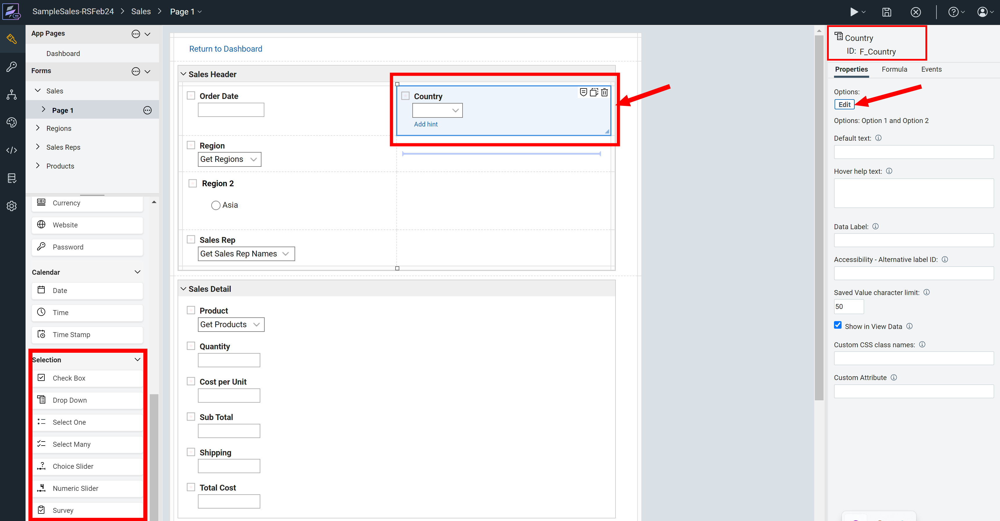

### **Phase 2 - Drop Down - Static Values**

When you select a drop down you have an option to populate the drop down with static values as shown below. We will explore how we can dynamically pull value in the next step.

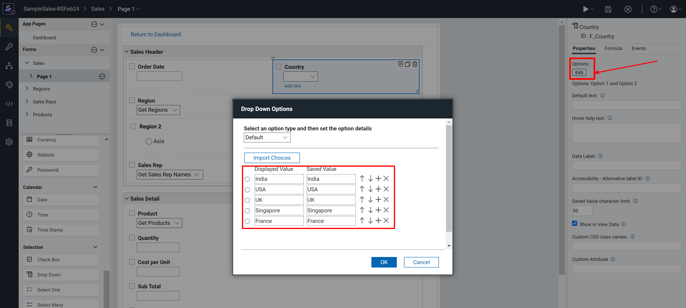

### **Phase 3 - Drop Down - Service**

Once you select Edit instead of Static values which is "Default" you can call a "Service".

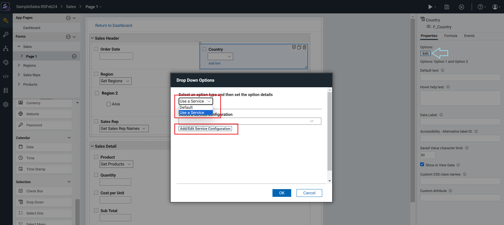

### **Phase 4 - What is a Service**

A service is an operation that allows Leap to communicate with other systems. Using a service you could call external applications like a servlet, web service or REST API. You can also communicate internally with any Leap application on the same server. Services can return a single item or a list of items. Services can be used to search, retrieve, update, create or delete.

Services are specific to a form, remember that an application can contain multiple forms. When deployed, a form can only reference services that it has registered.

You can either create your own service or select the same from the catalog as shown.

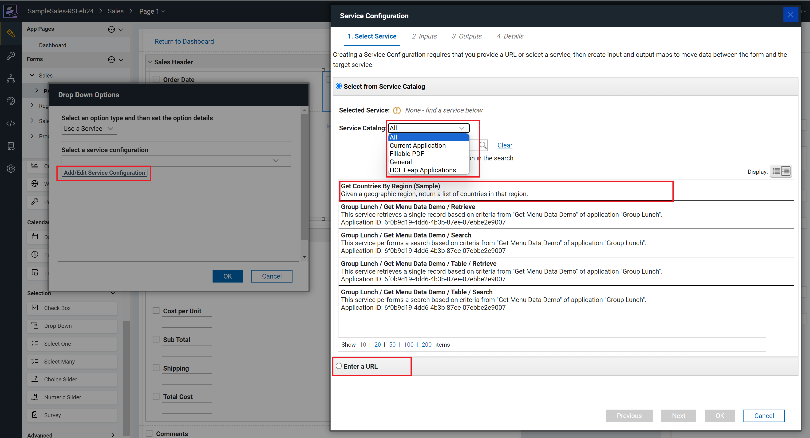

You can either populate the service from the list or you can use the URL to call the specific service.

### **Phase 5 - Creating a new Service for Lookup**

You can configure a service. We are using the scope **"Current Application"** as we will use the Country form to populate the values of the Country in the field.

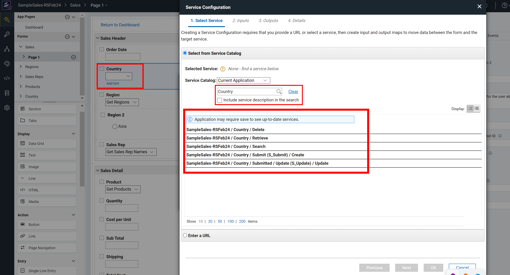

By default **HCL Leap** will provide the following type of services

- **_AppName / Form Name / Delete_** – Will delete the record that matches the search criteria.
- **_AppName / Form Name / Retrieve_** – Will return the record that matches the search criteria.
- **_AppName / Form Name / Search_** – Will return all the records that matches the search criteria.
- **_AppName / Form Name / Submit (S_Submit) / Create_** – Will create a new form record with all the data specified.
- **_AppName / Form Name / Submit (S_Update) / Update_** – Will update the specified record that matches the search criteria with all the data specified.
- **_AppName / Form Name / Table / Search_** – Will return all the rows of a table within the specified form that matches the search criteria.
- **_AppName / Form Name / Table / Retrieve_** – Will return the single row of a table within the specified form that matches the search criteria.

### **Phase 6 - Mapping Inputs**

We shall select **_AppName / Form Name / Search_** – This will return all the records that matches the search criteria. You can see we have selected Country below.

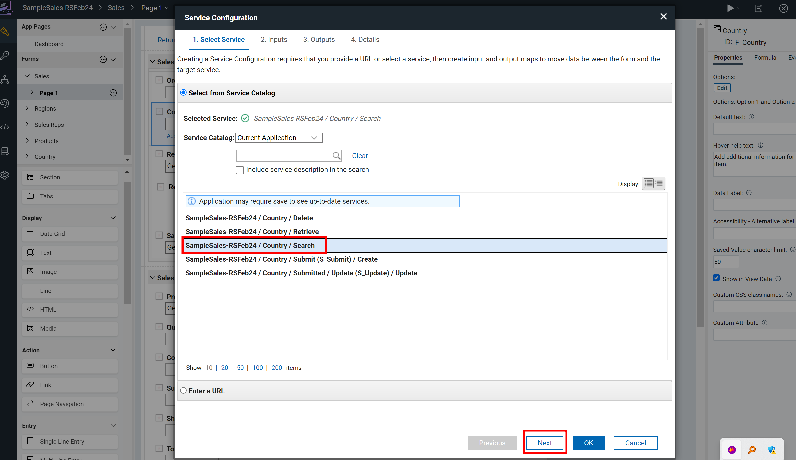

Say we wish to sort the list of countries so in the Input we can map the constant value **_"F_Country"_** with **_"Order By"_**.

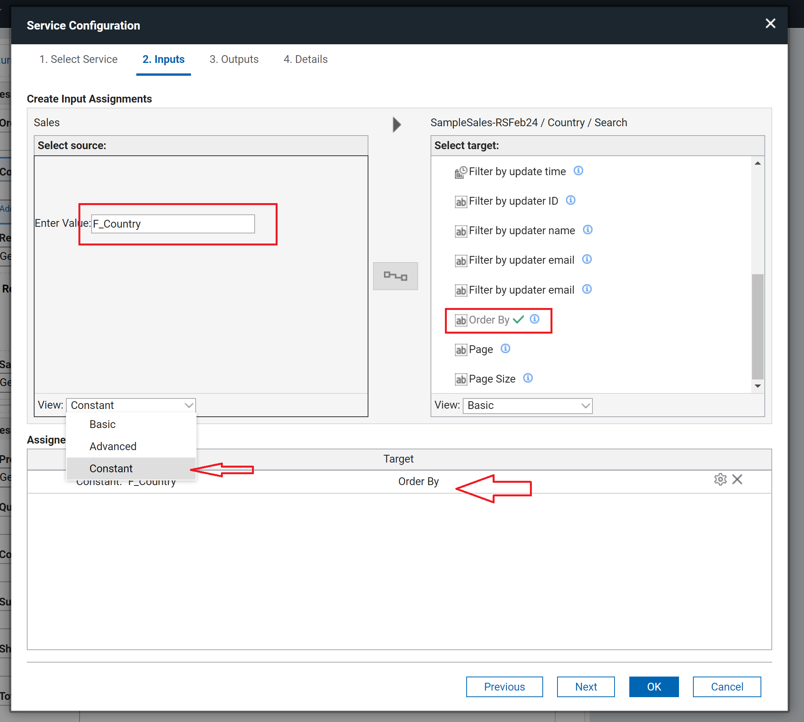

### **Phase 7 - Output Values**

We will need map the output values of search of **_"F_Country"_** from the **Country Form** and map it to fields in the current form. As the values for **"Saved Value"** and **"Displayed Value"** are the same. Please review the screen below.

### **Phase 8 - Naming the Service**

You can now define a meaningful name for the service so that it becomes easier to call the service whenever needed.

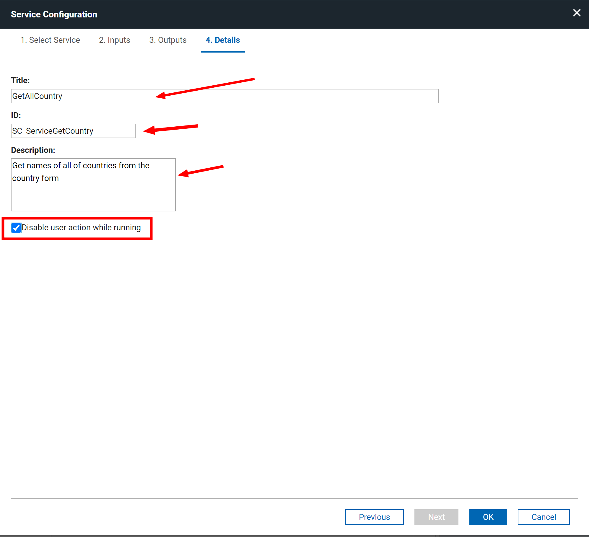

### **Phase 9 - Accessing the service - Lookup Country**

You can save and deploy the application. You can see that the country lookup is now working.

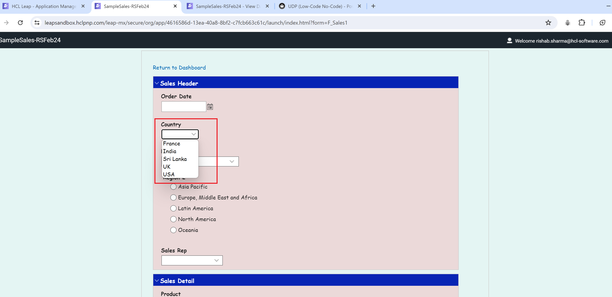

### **Phase 10 - Check Master and New Values**

Once the application is deployed you can see the master data. We shall add a new value called **"United Kingdom"** and now you can see the same in the Drop Down.

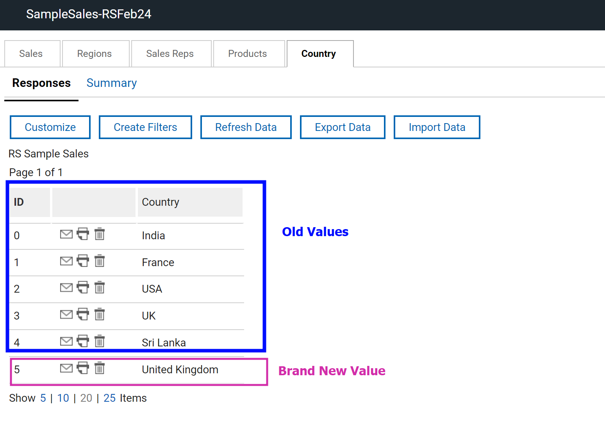

The new value of **"United Kingdom"** is visible.

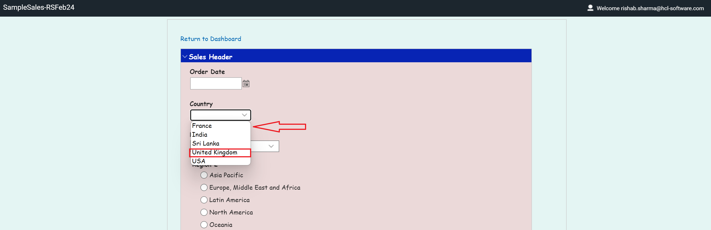

## **Closing and Followup**

Self Learning Courses for HCL Leap - [**HCL Software University Link**](https://hclsoftwareu.hcltechsw.com/hcl-leap)

[**HCL Leap Sandbox - Trial Account**](https://leapsandbox.hclpnp.com/leap-mx/)

This is the sixth article on this topic. Next Article we shall explore basics of workflow while building a citizen developer application using **HCL Leap**. Look out for another one next week. Till then happy reading and reach out to me if you would want more information..
